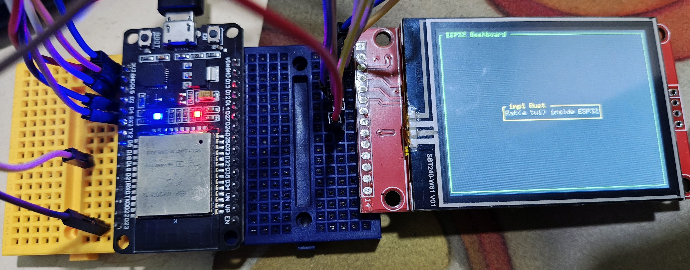

# RataTUI (Hello Rat)

This programs displays an example of using RataTUI in Embedded systems

## Output




## Code 

```rust
use std::error::Error;
use embedded_graphics::{pixelcolor::Rgb565, prelude::*};
use esp_idf_svc::hal::{
    delay::Delay, gpio::{AnyInputPin, PinDriver}, peripherals::Peripherals, spi::{
        Dma, SpiDeviceDriver, SpiDriver, config::Config
    }, units::Hertz
};

use mipidsi::{interface::SpiInterface, models::ILI9342CRgb565, Builder, options::{Orientation, Rotation}};

use mousefood::{
    EmbeddedBackend,
    EmbeddedBackendConfig
};

use ratatui::{
    layout::{
        Constraint,
        Flex,
        Layout
    },
    widgets::{
        Block,
        Paragraph,
        Wrap
    }
};
use ratatui::{style::*, Frame, Terminal};
use static_cell::StaticCell;

static SPI_BUFFER: StaticCell<[u8; 512]> = StaticCell::new();

fn main() {
    esp_idf_svc::sys::link_patches();

    esp_idf_svc::log::EspLogger::initialize_default();

    let peripherals = Peripherals::take().unwrap();

    let reset = PinDriver::output(peripherals.pins.gpio8).unwrap();
    let dc = PinDriver::output(peripherals.pins.gpio3).unwrap();

    let mut delay = Delay::new_default();

    let spi_driver = SpiDriver::new(
        peripherals.spi2,
        peripherals.pins.gpio10,
        peripherals.pins.gpio6,
        None::<AnyInputPin>,
        &esp_idf_svc::hal::spi::config::DriverConfig::default()
            .dma(Dma::Auto(320 * 240 * 2 + 8)),
    ).unwrap();

    let spi = SpiDeviceDriver::new(
        spi_driver,
        Some(peripherals.pins.gpio9),
        &Config::new().baudrate(Hertz(26_000_000))
    ).unwrap();

    let buffer = SPI_BUFFER.init([0; 512]);

    let di = SpiInterface::new(spi, dc, buffer);

    let mut display = Builder::new(
        ILI9342CRgb565,
        di
    )
        .reset_pin(reset)
        .init(&mut delay)
        .map_err(|_| Box::<dyn Error>::from("Display Init Failed"))
        .unwrap();

    display
        .set_orientation(Orientation::default().rotate(Rotation::Deg270))
        .map_err(|_| Box::<dyn Error>::from("Set Orientation Failed"))
        .unwrap();

    display
        .clear(Rgb565::BLACK)
        .map_err(|_| Box::<dyn Error>::from("Clear Display Failed"))
        .unwrap();

    let backend = EmbeddedBackend::new(&mut display, EmbeddedBackendConfig::default());

    let mut terminal = Terminal::new(backend)
        .map_err(|_| Box::<dyn Error>::from("Terminal creation failed")).unwrap();

    terminal.draw(hello_rat)
        .map_err(|_| Box::<dyn Error>::from("Draw Failed"))
        .unwrap();

    loop {
        log::info!("Drawing");
        delay.delay_ms(1000);
    }
}

fn hello_rat(frame: &mut Frame) {
    let outer_block = Block::bordered()
        .border_style(Style::new().green())
        .title(" ESP32 Dashboard ");
    frame.render_widget(outer_block, frame.area());

    let vertical_layout = Layout::vertical([Constraint::Length(3)])
        .flex(Flex::Center)
        .split(frame.area());

    let horizontal_layout = Layout::horizontal([Constraint::Length(25)])
        .flex(Flex::Center)
        .split(vertical_layout[0]);

    let text = "Rat(a tui) inside ESP32";
    let paragraph = Paragraph::new(text.dark_gray())
        .wrap(Wrap { trim: true })
        .centered();

    let bordered_block = Block::bordered()
        .border_style(Style::new().yellow())
        .title(" impl Rust ");

    frame.render_widget(paragraph.block(bordered_block), horizontal_layout[0]);
}
```
