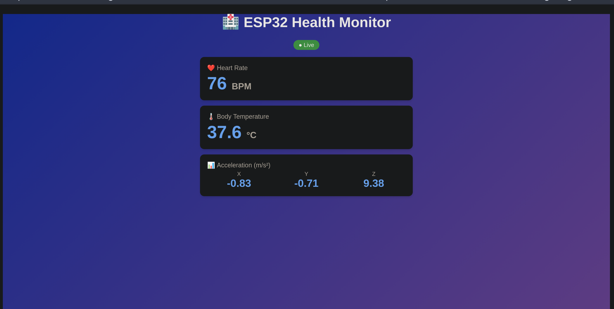
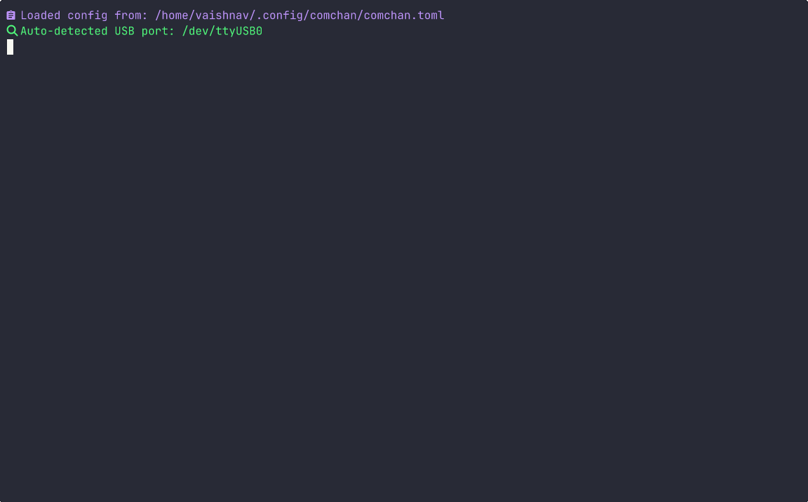

# WiFi Server

This code shows how to create a basic WiFi Server

## Output

### Website



### Serial Monitor




## Code 

```rust 
use esp_idf_svc::{
    eventloop::EspSystemEventLoop,
    hal::prelude::*,
    http::server::{Configuration, EspHttpServer},
    io::Write,
    nvs::EspDefaultNvsPartition,
    wifi::{BlockingWifi, ClientConfiguration, Configuration as WifiConfig, EspWifi},
};
use log::info;
use rand::Rng;
use std::sync::Mutex;

static HEART_RATE: Mutex<u8> = Mutex::new(75);
static TEMPERATURE: Mutex<f32> = Mutex::new(36.5);
static ACCEL_X: Mutex<f32> = Mutex::new(0.0);
static ACCEL_Y: Mutex<f32> = Mutex::new(0.0);
static ACCEL_Z: Mutex<f32> = Mutex::new(9.8);

fn main() {
    esp_idf_svc::sys::link_patches();
    esp_idf_svc::log::EspLogger::initialize_default();

    let peripherals = Peripherals::take().unwrap();
    let sysloop = EspSystemEventLoop::take().unwrap();
    let nvs = EspDefaultNvsPartition::take().unwrap();

    let mut wifi = BlockingWifi::wrap(
        EspWifi::new(peripherals.modem, sysloop.clone(), Some(nvs)).unwrap(),
        sysloop,
    ).unwrap();

    // Connect to your existing WiFi network
    wifi.set_configuration(&WifiConfig::Client(ClientConfiguration {
        ssid: "airtelc301-deco1".try_into().unwrap(),      // ← Change this
        password: "mother259$".try_into().unwrap(), // ← Change this
        ..Default::default()
    })).unwrap();

    info!("Connecting to WiFi...");
    wifi.start().unwrap();
    wifi.connect().unwrap();
    wifi.wait_netif_up().unwrap();

    // Get and display IP address
    let ip_info = wifi.wifi().sta_netif().get_ip_info().unwrap();
    info!("✅ WiFi Connected!");
    info!("📱 IP Address: {}", ip_info.ip);
    info!("🌐 Gateway: {}", ip_info.subnet.gateway);
    info!("🌐 Open in browser: http://{}", ip_info.ip);

    // Create HTTP server
    let mut server = EspHttpServer::new(&Configuration::default()).unwrap();

    // Health data endpoint
    server.fn_handler("/health", esp_idf_svc::http::Method::Get, |request| {
        let hr = *HEART_RATE.lock().unwrap();
        let temp = *TEMPERATURE.lock().unwrap();
        let ax = *ACCEL_X.lock().unwrap();
        let ay = *ACCEL_Y.lock().unwrap();
        let az = *ACCEL_Z.lock().unwrap();

        let json = format!(
            r#"{{"heartRate":{},"temperature":{:.2},"accelX":{:.2},"accelY":{:.2},"accelZ":{:.2},"timestamp":{}}}"#,
            hr, temp, ax, ay, az,
            std::time::SystemTime::now()
                .duration_since(std::time::UNIX_EPOCH)
                .unwrap()
                .as_secs()
        );

        info!("📤 Sending: {}", json);

        let mut response = request.into_ok_response()?;
        response.write_all(json.as_bytes())?;
        Ok::<(), anyhow::Error>(())
    }).unwrap();

    // Web interface
    server.fn_handler("/", esp_idf_svc::http::Method::Get, |request| {
        let html = r#"<!DOCTYPE html>
<html>
<head>
    <meta charset="UTF-8">
    <meta name="viewport" content="width=device-width, initial-scale=1">
    <title>ESP32 Health Monitor</title>
    <style>
        body { font-family: Arial, sans-serif; margin: 20px; background: linear-gradient(135deg, #667eea 0%, #764ba2 100%); min-height: 100vh; }
        .container { max-width: 600px; margin: 0 auto; }
        h1 { color: white; text-align: center; font-size: 2em; }
        .card { background: white; padding: 20px; margin: 15px 0; border-radius: 12px; box-shadow: 0 4px 6px rgba(0,0,0,0.1); }
        .label { color: #666; font-size: 0.9em; margin-bottom: 5px; }
        .value { font-size: 2.5em; font-weight: bold; color: #667eea; }
        .unit { font-size: 0.5em; color: #999; }
        .status { background: #4CAF50; color: white; padding: 5px 15px; border-radius: 20px; display: inline-block; font-size: 0.8em; }
        .grid { display: grid; grid-template-columns: repeat(3, 1fr); gap: 10px; }
        .grid-item { text-align: center; }
    </style>
    <script>
        function updateData() {
            fetch('/health')
                .then(r => r.json())
                .then(data => {
                    document.getElementById('hr').innerText = data.heartRate;
                    document.getElementById('temp').innerText = data.temperature.toFixed(1);
                    document.getElementById('ax').innerText = data.accelX.toFixed(2);
                    document.getElementById('ay').innerText = data.accelY.toFixed(2);
                    document.getElementById('az').innerText = data.accelZ.toFixed(2);
                    document.getElementById('status').innerText = '● Live';
                })
                .catch(e => {
                    document.getElementById('status').innerText = '● Offline';
                    document.getElementById('status').style.background = '#f44336';
                });
        }
        setInterval(updateData, 2000);
        updateData();
    </script>
</head>
<body>
    <div class="container">
        <h1>🏥 ESP32 Health Monitor</h1>
        <div style="text-align: center; margin-bottom: 20px;">
            <span class="status" id="status">● Connecting...</span>
        </div>
        
        <div class="card">
            <div class="label">❤️ Heart Rate</div>
            <div class="value"><span id="hr">--</span> <span class="unit">BPM</span></div>
        </div>
        
        <div class="card">
            <div class="label">🌡️ Body Temperature</div>
            <div class="value"><span id="temp">--</span> <span class="unit">°C</span></div>
        </div>
        
        <div class="card">
            <div class="label">📊 Acceleration (m/s²)</div>
            <div class="grid">
                <div class="grid-item">
                    <div style="color: #999; font-size: 0.8em;">X</div>
                    <div style="font-size: 1.5em; font-weight: bold; color: #667eea;"><span id="ax">--</span></div>
                </div>
                <div class="grid-item">
                    <div style="color: #999; font-size: 0.8em;">Y</div>
                    <div style="font-size: 1.5em; font-weight: bold; color: #667eea;"><span id="ay">--</span></div>
                </div>
                <div class="grid-item">
                    <div style="color: #999; font-size: 0.8em;">Z</div>
                    <div style="font-size: 1.5em; font-weight: bold; color: #667eea;"><span id="az">--</span></div>
                </div>
            </div>
        </div>
    </div>
</body>
</html>"#;

        let mut response = request.into_ok_response()?;
        response.write_all(html.as_bytes())?;
        Ok::<(), anyhow::Error>(())
    }).unwrap();

    info!("🚀 HTTP Server started!");

    // Update sensor data in background
    std::thread::spawn(move || {
        let mut rng = rand::rng();
        loop {
            std::thread::sleep(std::time::Duration::from_secs(2));

            *HEART_RATE.lock().unwrap() = rng.random_range(60..=180);
            *TEMPERATURE.lock().unwrap() = rng.random_range(36.0..38.0);
            *ACCEL_X.lock().unwrap() = rng.random_range(-1.5..1.5);
            *ACCEL_Y.lock().unwrap() = rng.random_range(-1.5..1.5);
            *ACCEL_Z.lock().unwrap() = rng.random_range(8.0..11.0);
        }
    });

    loop {
        std::thread::sleep(std::time::Duration::from_secs(1));
    }
}

```
